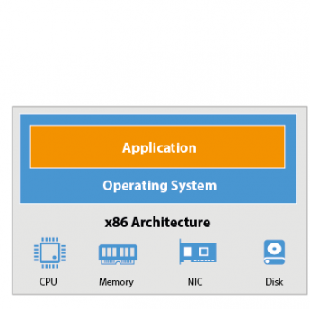
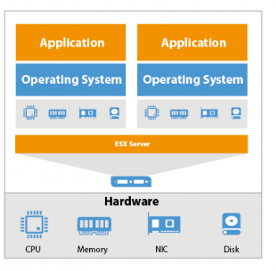
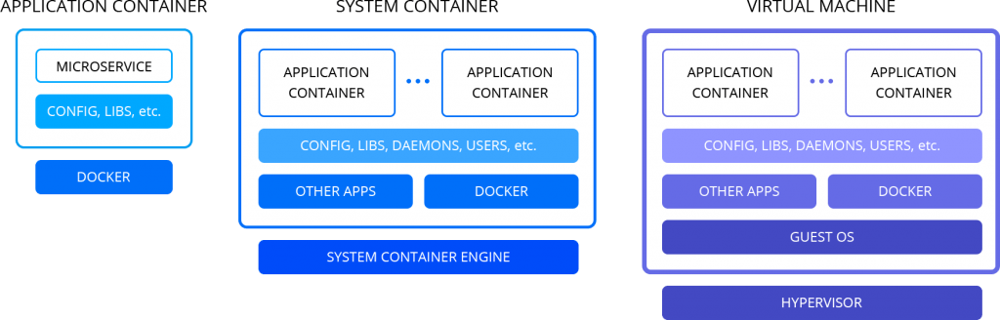

# Proposition des types de serveurs et de certaines solutions comme les containers et le cloud.

Vu que les entreprises investissent plus que jamais dans l'infrastructure numérique nécessaire pour rester compétitives dans un paysage économique de plus en plus dynamique et en évolution rapide.
Alors, vous devez vous assurer que l'infrastructure de votre organisation peut supporter la charge de travail et effectuer des opérations commerciales sans décalages ni interruptions.
L'infrastructure de votre organisation ou entreprise peut être construite sur un serveur physique, un serveur virtuel ou une combinaison des deux (un serveur hybride) et aussi sur le cloud.
Par conséquent, il est essentiel de prendre en compte un certain nombre de facteurs lors du choix entre les options disponibles.
Tout au long de cet article nous allons parler des serveurs physiques, des serveurs virtuelles, du cloud, des conteneurs et comprendre quels investissements dans l'infrastructure numérique seront adaptés à vos besoins.

## Les serveurs physique:

* Qu'est ce qu'un server physique ?

    Un serveur physique, également appelé "serveur bare metal", est un serveur informatique à locataire unique, ce qui signifie qu'un serveur physique spécifique est désigné pour un seul utilisateur.
    Les ressources et les composants d'un serveur physique ne sont pas partagés entre plusieurs utilisateurs.
    Chaque serveur physique comprend une mémoire, un processeur, une connexion réseau, un disque dur et un système d'exploitation (OS) pour exécuter des programmes et des applications.
    Un serveur bare metal est de grande taille en raison des puissants composants de traitement qu'il contient.

    

## Les serveurs vrituels:

Tout d'abord, nous allons definir quelques concepts tel que la *virtualisation* et *hyperviseur* avant d'aborder notre terme qui est **le serveur virtuel**.

* Qu'est-ce que la virtualisation ?

    La virtualisation est le processus de création d'un environnement informatique simulé qui est abstrait du matériel informatique physique, essentiellement un ordinateur généré par ordinateur. La virtualisation vous permet de créer plusieurs instances informatiques virtuelles à partir des composants matériels et logiciels d'une seule machine. Ces instances peuvent être un ordinateur au sens traditionnel ou un référentiel de stockage, une application, un serveur ou une configuration réseau.

* Qu'est-ce qu'un hyperviseur ?

    Le logiciel qui permet la virtualisation s'appelle un hyperviseur. Il s'agit d'une couche logicielle légère qui se situe entre le matériel physique et les environnements virtualisés et permet à plusieurs systèmes d'exploitation (OS) de fonctionner en tandem sur le même matériel. L'hyperviseur est l'intermédiaire qui extrait les ressources des matières premières de votre infrastructure et les dirige vers les différentes instances de calcul.

* Qu'est-ce qu'une machine virtuelle ?

    Un serveur virtuel est un environnement logiciel qui émule les processus d'un ordinateur réel. Bien que les utilisateurs finaux ne soient pas en mesure de faire la différence entre un serveur virtuel correctement configuré et un serveur physique, ils interagiront en réalité avec une virtualisation des ressources informatiques d'un serveur physique. Les mêmes ressources qui prennent en charge un serveur physique (RAM et processeurs, par exemple) ont toutes des contreparties logicielles affectées à une charge de travail donnée fonctionnant sur un serveur virtuel.

    L'architecture d'un serveur virtuel est un peu plus complexe que celle d'un serveur physique.
    Ainsi, un hyperviseur, tel que VMware vSphere, KVM ou Microsoft Hyper-V, est installé au-dessus du matériel physique.
    Un hyperviseur est ensuite utilisé pour créer et gérer des VM, qui disposent de leurs propres ressources informatiques virtuelles.
    Après cela, vous pouvez charger plusieurs systèmes d'exploitation invités et applications serveur sur le matériel virtuel.
    Ainsi, les serveurs virtuels permettent de faire tourner plusieurs OS et applications sur la base du matériel physique partagé.

    

### Comparaison des serveurs physiques et des serveurs virtuels

 Pour voir les différences entre le serveur physique et le serveur virtuel, un examen plus approfondi de tous leurs composants est nécessaire.

* **Performance**

    Ce facteur doit être pris en compte si votre organisation travaille avec une grande quantité de données qui doivent être traitées en permanence.
    Les serveurs physiques sont beaucoup plus puissants et efficaces que les machines virtuelles, car les machines virtuelles sont sujettes à des problèmes de performances en raison d'un débordement de serveurs virtuels dans une machine physique.
    Ainsi, une machine physique et une machine virtuelle, ayant toutes deux les mêmes ressources et capacités matérielles et logicielles, ne peuvent pas fonctionner au même niveau.
    Si votre organisation exécute des opérations qui nécessitent l'utilisation maximale des ressources informatiques, un serveur physique est le choix optimal.

* **La gestion**

    En ce qui concerne le facteur de gestion, les machines virtuelles sont beaucoup plus faciles à entretenir que les serveurs physiques.
    En cas de panne du serveur, la restauration d'un serveur physique à son état d'origine peut prendre plusieurs jours.
    Pour les VM, le processus de récupération peut être lancé en quelques clics à l'aide d'une
    sauvegarde de VM préalablement créée .
    De plus, un serveur physique doit être inspecté de près pour détecter toute défaillance et, si nécessaire, des pilotes supplémentaires doivent être installés et configurés avant de pouvoir être utilisés.
    Ce n'est pas le cas des machines virtuelles car elles sont construites sur du matériel physique prêt à l'emploi.
    Ainsi, les VM peuvent être créées et activées en quelques minutes. 
    Par ailleurs, la gestion d'un environnement de serveurs virtuels nécessite un haut niveau d'expertise et des compétences spécifiques.
    Alors, il faut s'assurrer que les membres de votre équipe informatique sont suffisamment compétents pour contrôler votre infrastructure virtuelle.

* **Portabilité**

    Vous pouvez facilement déplacer des machines virtuelles dans l'environnement virtuel et même d'un serveur physique à un autre, avec une intervention minimale de votre part.
    Cela est dû au fait que les machines virtuelles sont isolées les unes des autres et possèdent leur propre matériel virtuel, ce qui rend une machine virtuelle indépendante du matériel.
    Le déplacement de votre environnement de serveur physique vers un autre emplacement est une tâche plus gourmande en ressources.
    Dans ce cas, vous devrez copier toutes les données stockées sur le serveur sur un support amovible, transporter le support ainsi que toutes les ressources matérielles dont vous disposez vers un nouvel emplacement, puis réinstaller tous les composants du système sur un nouveau serveur.
    Essentiellement, vous devrez reconstruire un serveur à partir de zéro.

* **Évolutivité**

    Pour étendre un environnement de serveur physique, vous devez acheter des composants matériels supplémentaires, qui peuvent être très coûteux, et passer par un long processus d'installation et de configuration.
    Dans le même temps, un environnement de serveur virtuel offre la possibilité d'une évolutivité à la demande.
    Un seul serveur virtuel peut héberger plusieurs machines virtuelles en même temps, qui peuvent être ajoutées ou supprimées d'un simple clic de souris.
    Votre environnement virtuel peut être agrandi ou réduit en fonction de la croissance des besoins de votre entreprise.
    Dans ce cas, vous n'avez pas besoin d'acheter de matériel supplémentaire pour assurer le déploiement de la VM.
    Cela est dû au fait que les machines virtuelles exécutées sur l'hôte partagent les mêmes ressources informatiques, qui peuvent être réparties de manière égale entre toutes les machines virtuelles.
    Ainsi, vous pouvez concevoir un environnement facilement configurable qui peut effectuer des opérations de n'importe quel niveau de complexité.

* **Gestion de la capacité**

    Les serveurs physiques n'utilisent pas leurs capacités matérielles et logicielles au maximum, leur capacité de production moyenne étant de 25 %.
    Ainsi, de nombreuses ressources informatiques restent inutilisées, ce qui n'est pas rentable.
    D'autre part, un serveur hébergeant plusieurs VM s'occupe des ressources sous-utilisées en les distribuant aux autres VM qui en ont le plus besoin.
    De cette façon, une gestion optimale de la capacité est obtenue.

* **Récupération du système**

    Si le site de production est touché par un sinistre, il est essentiel de restaurer rapidement les données et les opérations critiques afin de réduire les temps d'arrêt du système et de minimiser son impact négatif sur l'entreprise.
    La restauration des opérations commerciales exécutées sur un serveur physique peut prendre plusieurs heures ou plusieurs jours.
    Dans ce cas, le processus de reprise après sinistre (DR) implique la configuration d'un nouveau serveur physique, l'installation d'un système d'exploitation, la configuration d'applications et la restauration de données critiques à partir de sauvegardes.

    Le processus DR dans un environnement virtuel est beaucoup plus simple.
    Vous pouvez restaurer l'intégralité de la machine virtuelle sur un site DR à l'aide de sauvegardes de machine virtuelle créées précédemment, ce qui entraîne un temps d'arrêt quasi nul.

* **Continuité de l'activité**

    Actuellement, les entreprises sont censées fonctionner en permanence, ce qui signifie que même une interruption mineure des opérations commerciales peut avoir des répercussions majeures.
    Par conséquent, assurer la continuité des activités, en particulier en cas de sinistre, devrait être l'une des principales priorités de toute organisation.

    Lorsque l'on compare les serveurs physiques et les machines virtuelles, il devient évident que les machines virtuelles sont plus tolérantes aux pannes.
    En cas de sinistre, la charge de travail de votre environnement virtuel peut être transférée en quelques clics vers un autre site, afin d'assurer le minimum d'indisponibilité.
    Une fois les effets du sinistre atténués et le centre de production restauré, vous pouvez redéplacer la charge de travail du site DR vers le site principal.

    Si un sinistre a affecté ou détruit votre infrastructure de serveur physique, les dommages, dans la plupart des cas, sont irréversibles.

* **Sécurité**

    La gestion de la sécurité est plus facilement configurable dans un environnement de serveur virtuel que dans un environnement physique.
    Avec les serveurs physiques, vous devez créer un système de protection pour chaque serveur individuel, en fonction de ses capacités et ressources informatiques et de la sensibilité des données qu'il stocke.
    Cela peut être une tâche gourmande en ressources si votre infrastructure informatique repose sur 10 serveurs physiques ou plus.

    D'autre part, un environnement de serveur virtuel peut être protégé sur la base d'un modèle de sécurité universel.
    Ainsi, les politiques et procédures de sécurité peuvent être développées, documentées et mises en œuvre à partir d'un seul écran, c'est-à-dire via le tableau de bord de l'hyperviseur.

* **Frais**

    La création et la maintenance d'un environnement de serveur physique peuvent être assez coûteuses.
    Cela est dû aux mises à niveau constantes du matériel et des logiciels, aux pannes fréquentes du système et aux pannes de composants et d'équipements informatiques, qui sont difficiles, voire impossibles à réparer.

    Dans le même temps, la virtualisation est considérée comme une option parfaite pour les entreprises qui contiennent un grand nombre de serveurs.
    Un environnement de serveur virtuel vous permet de répartir uniformément les ressources informatiques entre toutes les machines virtuelles en cours d'exécution, garantissant ainsi une optimisation de la capacité pour un prix minimal.
    Cependant, vous devez noter que les licences logicielles VM peuvent également être assez chères.
    Selon la taille de l'environnement virtuel, le prix peut atteindre quelques milliers de dollars.

Voici un tableau récaptulatif des comparaisons:

| Serveurs physiques    | Machines virtuelles |
|-------|------------|
| Coûts initiaux importants    | Petits frais initiaux   |
| Pas besoin d'acheter une licence   | Licences logicielles VM   |
| Les serveurs physiques et les équipements supplémentaires prennent beaucoup d'espace    | Un seul serveur physique peut héberger plusieurs VM, économisant ainsi de l'espace   |
| A un cycle de vie court    | Prend en charge les applications héritées   |
| Pas d'évolutivité à la demande    | Évolutivité à la demande   |
| Les mises à niveau matérielles sont difficiles à mettre en œuvre et peuvent entraîner des temps d'arrêt considérables    | Les mises à niveau matérielles sont plus faciles à mettre en œuvre; la charge de travail peut être migrée vers un site de secours pendant la période de réparation afin de minimiser les temps d'arrêt   |
| Difficile à déplacer ou à copier    | Facile à déplacer ou à copier   |
| Mauvaise optimisation des capacités    | L'optimisation avancée de la capacité est activée par l'équilibrage de charge   |
| Ne nécessite aucune couche supérieure    | Un certain niveau de surcharge est requis pour l'exécution des machines virtuelles   |
| Parfait pour les organisations exécutant des services et des opérations qui nécessitent un matériel informatique hautement productif pour leur mise en œuvre    | Parfait pour les organisations exécutant plusieurs opérations ou desservant plusieurs utilisateurs, qui prévoient d'étendre leur environnement de production à l'avenir   |

Comme vous pouvez le voir, les machines physiques et les machines virtuelles (serveurs virtuels) sont différentes les unes des autres et offrent des avantages différents aux organisations.
Par conséquent, lorsque vous choisissez entre les deux options, vous devez définir clairement le nombre d'opérations que votre entreprise exécute, le niveau de performance que vos clients attendent de l'organisation et vos buts et objectifs commerciaux.
En outre, vous devez également tenir compte de facteurs tels que le **budget alloué**, la **tolérance aux temps d'arrêt**, la **charge de travail**, la **sensibilité des données** et la **nécessité d'une gestion des performances**.
Tous ces facteurs déterminent ce que votre infrastructure informatique doit inclure pour atteindre une productivité et une croissance élevées.

## Les conteneurs:

* Qu'est-ce qu'un conteneur ?

    Les conteneurs créent des environnements isolés dans un serveur physique en virtualisant le système d'exploitation hôte, généralement *Linux* ou *Windows* et en exécutant des applications packagées par-dessus.

    Au lieu de virtualiser le matériel comme les machines virtuelles, les conteneurs virtualisent le système d'exploitation. Il est construit sur un noyau de système d'exploitation hôte et partage généralement ses bibliothèques et ses fichiers binaires.

    Parce qu'ils partagent la plupart de ses nécessités, les conteneurs ne contiennent que l'application et ses dépendances. Ils sont beaucoup plus légers que les machines virtuelles et ne font que des mégaoctets.
    
    La technologie des conteneurs existe depuis longtemps, mais le lancement de Docker en 2013 a fait des conteneurs la norme de l'industrie pour le développement d'applications et de logiciels. Ils résolvent le problème de l'incohérence de l'environnement. Les développeurs écrivent généralement du code localement, par exemple sur leur ordinateur portable, puis déploient ce code sur un serveur. Toute différence entre ces environnements (versions logicielles, autorisations, accès à la base de données, etc.) entraîne des bogues. Avec les conteneurs, les développeurs peuvent créer une unité packagée portable qui contient toutes les dépendances nécessaires pour que cette unité s'exécute dans n'importe quel environnement, qu'il soit local, de développement, de test ou de production.

    D'où, il est bon de savoir que grâce au boom des conteneurs, les **architectures de microservices** pour le développement d'applications ont évolué. Avec les conteneurs, les applications pourraient être décomposées en leurs plus petits composants ou « services » qui servent un seul objectif, et ces services pourraient être développés et déployés indépendamment les uns des autres plutôt que dans une seule unité monolithique. Par exemple, supposons que vous ayez une application qui permet aux clients d'acheter n'importe quoi dans le monde. Vous pouvez avoir une barre de recherche, un panier, un bouton d'achat, etc. Chacun de ces "services" peut exister dans son propre conteneur, de sorte que si, par exemple, la barre de recherche échoue en raison d'une charge élevée, cela n'apporte pas le tout vers le bas.

    

### Outils de conteneur:

**Conteneurs Linux (LXC)** : Communément appelés LXC, il s'agit de la technologie de conteneur Linux d'origine. LXC est une méthode de virtualisation au niveau du système d'exploitation Linux pour exécuter plusieurs systèmes Linux isolés sur un seul hôte.

**Docker** : Docker a commencé comme un projet visant à créer des conteneurs LXC à application unique, introduisant plusieurs modifications dans LXC qui rendent les conteneurs plus portables et flexibles à utiliser. Il s'est ensuite transformé en son propre environnement d'exécution de conteneur. À un niveau élevé, Docker est un utilitaire Linux qui peut créer, expédier et exécuter efficacement des conteneurs.

**Kubernetes** : Kubernetes n'est pas un logiciel de conteneur en soi, mais plutôt un orchestrateur de conteneurs comme **Amazon Elastic Contaier Service** (ECS), **Azure Contaier Service** (ACS), etc, qui sont propres aux differents cloud providers. Dans ce monde de microservices natifs du cloud, lorsque certaines applications exécutent des centaines, des milliers, voire des milliards de conteneurs, Kubernetes permet d'automatiser la gestion de tous ces conteneurs. Il ne peut pas fonctionner sans un outil comme Docker en tandem, mais c'est un si grand nom dans l'espace conteneur qu'il ne serait pas un poste de conteneur sans le mentionner.

Nous savons tous que la **virtualisation** a permis l'automatisation et la standardisation des services d'infrastructure et permet à plusieurs machines virtuelles de fonctionner sur de grands serveurs physiques, ce qui entraîne une consolidation et des économies importantes.

Alors que la **conteneurisation** permet l'automatisation et la standardisation des services de livraison et de gestion des applications et permet à plusieurs services d'application de s'exécuter sur une seule ou sur un grand pool de machines virtuelles ou physiques.

Nous allons maintenant voir une comparaison des VM et des conteneurs dans un tableau de façon concret:

| VM    | CONTENEURS |
|-------|------------|
| Poids lourd.    | Poids léger.   |
| Performances limitées.   | Performances natives.   |
| Chaque machine virtuelle s'exécute dans son propre système d'exploitation.    | Tous les conteneurs partagent le système d'exploitation hôte.   |
| Virtualisation au niveau matériel.    | Virtualisation du système d'exploitation.   |
| Temps de démarrage en minutes.    | Temps de démarrage en millisecondes.   |
| Alloue la mémoire requise.    | Nécessite moins d'espace mémoire.   |
| Entièrement isolé et donc plus sécurisé.    | Isolation au niveau du processus, peut-être moins sécurisée.   |

### L'usage des machines virtuelles et des conteneurs.

Les conteneurs et les machines virtuelles présentent des avantages et des inconvénients, et la décision finale dépendra de vos besoins spécifiques.

Les machines virtuelles sont un meilleur choix pour exécuter des applications qui nécessitent toutes les ressources et fonctionnalités du système d'exploitation lorsque vous devez exécuter plusieurs applications sur des serveurs ou que vous avez une grande variété de systèmes d'exploitation à gérer. Si vous avez une application monolithique existante que vous ne prévoyez pas ou n'avez pas besoin de refactoriser en microservices, les machines virtuelles continueront de bien servir votre cas d'utilisation.

Les conteneurs sont un meilleur choix lorsque votre plus grande priorité est de maximiser le nombre d'applications ou de services exécutés sur un nombre minimal de serveurs et lorsque vous avez besoin d'une portabilité maximale. Si vous développez une nouvelle application et que vous souhaitez utiliser une architecture de microservices pour l'évolutivité et la portabilité, les conteneurs sont la solution. Les conteneurs brillent lorsqu'il s'agit de développer des applications cloud natives basées sur une architecture de microservices.

